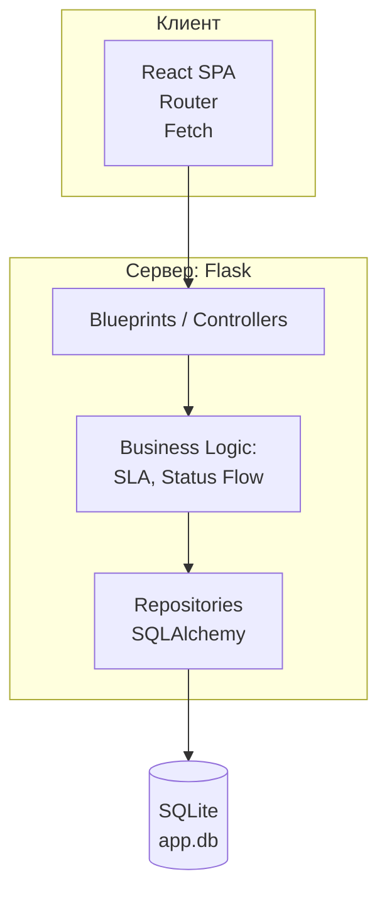
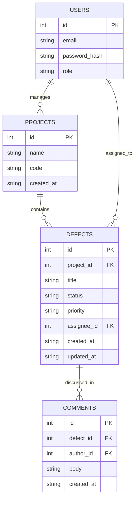

### 1 Контекст (C1)

```mermaid
flowchart LR
    engineer([Инженер])
    manager([Менеджер])
    ui[React SPA]
    api[[Flask API\nDefects]]
    db[(SQLite\napp.db)]

    subgraph Domains[Домены]
        auth[[Users / Auth]]
        projects[[Projects]]
        defects[[Defects]]
        reports[[Reports (calc)]]
    end

    engineer --> ui
    manager  --> ui
    ui       --> api
    api      --> db

    api --- auth
    api --- projects
    api --- defects
    api --- reports
```

### 2 Слои/Компоненты (C2)



### 3 ER-диаграмма (таблицы и связи)


