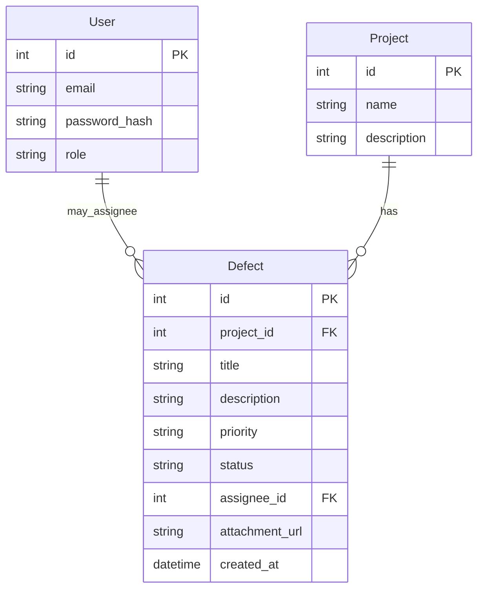

# ERD

```mermaid
erDiagram
  User ||--o{ Defect : may_assignee
  Project ||--o{ Defect : has

  User {
    int id PK
    string email
    string password_hash
    string role
  }
  Project {
    int id PK
    string name
    string description
  }
  Defect {
    int id PK
    int project_id FK
    string title
    string description
    string priority
    string status
    int assignee_id FK
    string attachment_url
    datetime created_at
  }
```