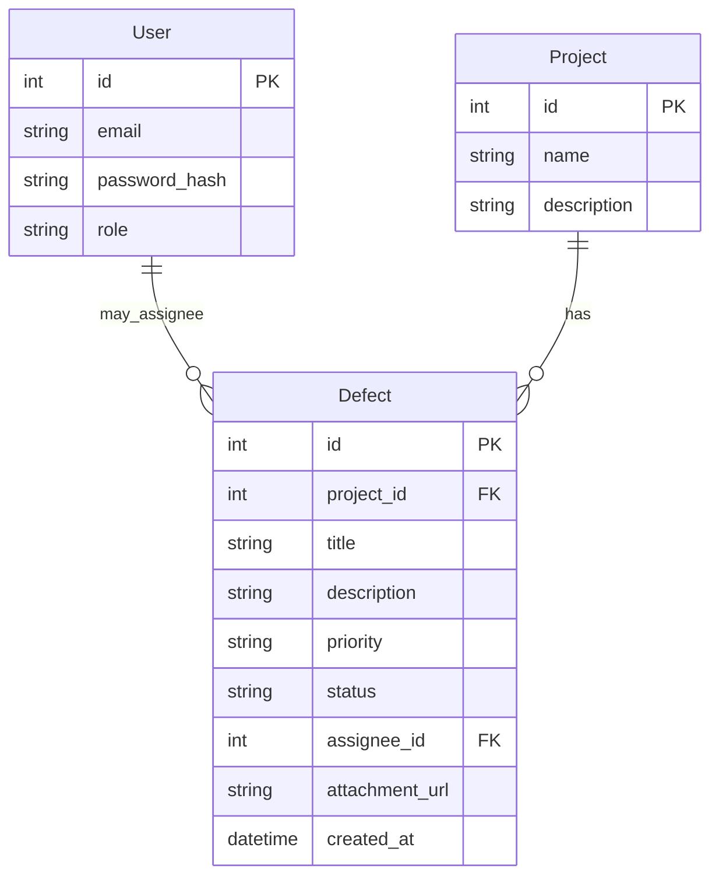
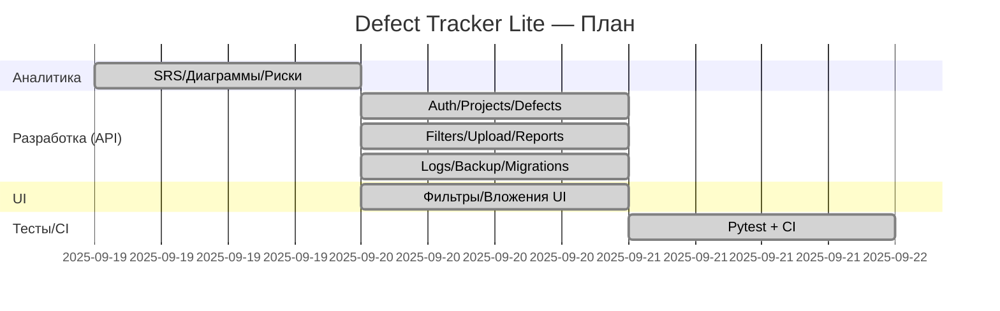

## Report — **Defect Tracker Lite**

### 1. Цель

Разработать минимальный реестр дефектов со входом в систему, разграничением прав, CRUD по проектам и дефектам, фильтрами, вложениями файлов и простой отчётностью. Подготовить тесты и инструкцию запуска. Соответствие критериям «на 3»: базовые FR/роли, простая архитектура и БД, 1–2 ключевых модуля, базовая аутентификация (хэш паролей), ≥2–3 юнит-теста, локальный запуск.

### 2. Роли и пользователи

* **manager** — полные права, может создавать проекты, править дефекты.
* **engineer** — создание/редактирование дефектов, просмотр проектов.

### 3. Функциональные требования (FR)

1. **FR-1**: Авторизация (`/api/auth/login`) с выдачей JWT.
2. **FR-2**: Проекты — список (`GET /api/projects`) и создание (`POST /api/projects`, только *manager*).
3. **FR-3**: Дефекты — создание (`POST /api/defects`), обновление (`PATCH /api/defects/{id}`), получение списка (`GET /api/defects`).
4. **FR-4**: Фильтры дефектов: `project_id`, `status`, `priority`, `q` (поиск в заголовке/описании), `date_from`, `date_to`.
5. **FR-5**: Загрузка вложений к дефекту (`POST /api/upload`, типы: png/jpg/webp/pdf) и раздача `/uploads/*`.
6. **FR-6**: Отчёт-сводка (`GET /api/reports/summary`) по статусам/приоритетам.
7. **FR-7**: Health-check (`GET /api/health`).

### 4. Нефункциональные требования (NFR)

* **NFR-1**: Запуск локально: бэк — зелёной кнопкой в WebStorm/`python app.py`, фронт — `npm start`.
* **NFR-2**: Безопасность: хранение паролей в хэше (`generate_password_hash`), доступ к изменяющим эндпоинтам только по JWT (`Authorization: Bearer …`).
* **NFR-3**: Ограничение вложений: размер ≤ 10 МБ, список разрешённых расширений.
* **NFR-4**: Логирование с ротацией (1 МБ × 5) — `RotatingFileHandler`.
* **NFR-5**: Тестируемость: набор Pytest + минимальный CI (GitHub Actions).
* **NFR-6**: Простейшая автоматическая «миграция» SQLite: добавление колонок, если их нет (PRAGMA + `ALTER TABLE`).

### 5. Архитектура

* **Тип**: монолит (Flask API + React SPA), БД — SQLite.
* **Слои**:
  Транспорт (Flask routes) → Бизнес-логика (валидации, фильтры, роли) → Доступ к данным (SQLAlchemy модели).
* **Варианты масштабирования**: перенос БД на PostgreSQL; хранение файлов во внешнем объектном хранилище (S3/MinIO); упаковка API в gunicorn/uvicorn за reverse-proxy; фронт статикой на CDN.

### 6. ER-диаграмма



### 7. Use Cases

* **UC-1**: Логин (получить JWT).
* **UC-2**: Создать проект (*manager*).
* **UC-3**: Создать дефект с вложением.
* **UC-4**: Отфильтровать дефекты по проекту/статусу/приоритету/дате/поиску.
* **UC-5**: Обновить статус/приоритет дефекта.
* **UC-6**: Получить сводку по статусам и приоритетам.

### 8. План работ (WBS/Gantt)



### 9. Риски

| ID | Риск                            | Вероятность | Влияние | Меры                                       |
| -- | ------------------------------- | ----------- | ------- | ------------------------------------------ |
| R1 | Несовпадение схемы БД и моделей | средняя     | средняя | PRAGMA-проверка и `ALTER TABLE` при старте |
| R2 | Загрузка вредоносных файлов     | средняя     | средняя | ALLOWED\_EXT + ограничение размера         |
| R3 | Утечка токена                   | низкая      | средняя | HTTPS на деплое, короткий TTL JWT          |
| R4 | Потеря файла БД                 | средняя     | высокая | скрипт бэкапа, хранение копий              |
| R5 | Рост нагрузки                   | низкая      | средняя | перенос на Postgres, индексы, кэш          |

### 10. Трассировка требований → реализация → тесты

| Требование       | Эндпоинт/Экран                   | Реализация                            | Проверка                    |
| ---------------- | -------------------------------- | ------------------------------------- | --------------------------- |
| FR-1 Авторизация | `/api/auth/login`                | JWT, хэш пароля                       | Pytest: логин ok/ошибка     |
| FR-2 Проекты     | `GET/POST /api/projects`         | POST только *manager*                 | Pytest: доступ ролей        |
| FR-3 Дефекты     | `GET/POST/PATCH /api/defects`    | CRUD + валидаторы                     | Pytest: создание/обновление |
| FR-4 Фильтры     | `GET /api/defects` с query       | `project_id/status/priority/q/date_*` | Pytest: фильтрация          |
| FR-5 Вложения    | `POST /api/upload`, `/uploads/*` | типы/размер, сохранение URL           | Smoke: UI загрузка          |
| FR-6 Отчёт       | `GET /api/reports/summary`       | агрегации по статусам/приоритетам     | Pytest: сводка              |
| FR-7 Health      | `GET /api/health`                | ping с ts                             | Pytest: 200 OK              |
| NFR-Логи         | `logs/app.log`                   | RotatingFileHandler                   | Визуально/ручной просмотр   |
| NFR-Миграции     | при `init_db()`                  | PRAGMA + `ALTER TABLE`                | Логи «DB migrated…»         |

### 11. Тест-план (минимум на «3»)

* **Юнит-тесты** (pytest, ≥5):

    1. health 200;
    2. логин ok/ошибка;
    3. права: *engineer* не может `POST /projects`, *manager* — может;
    4. создание дефекта и фильтрация (`q`/`priority`/`project_id`);
    5. отчёт-сводка (есть группы по статусам/приоритетам).
* **Интеграционные**: загрузка вложения, создание дефекта с `attachment_url`, отображение ссылки в UI.
* **Smoke**: полный локальный запуск по README; базовые CRUD-сценарии.

### 12. Результаты

* Реализованы: авторизация (JWT), роли, проекты и дефекты, фильтры, вложения, отчёт-сводка.
* Логи и «мягкие миграции» включены; есть бэкап БД.
* Тесты (pytest) проходят локально; есть простой CI (GitHub Actions).
* Инструкция запуска краткая, соответствует требованиям: бэк — зелёная кнопка/`python app.py`, фронт — `npm start`.

### 13. Вывод

Проект **полностью соответствует** критериям «на 3» во всех разделах: Анализ, Проектирование, Разработка, Безопасность, Тестирование, Введение в эксплуатацию.

### Приложение А. Краткая памятка по запуску

```bash
# Backend (Windows)
cd backend
python -m venv .venv
.venv\Scripts\pip install -r requirements.txt
.venv\Scripts\python app.py
# или просто открыть app.py в WebStorm и нажать зелёную кнопку Run

# Frontend
cd frontend
npm install
npm start
```

### Приложение B. Обзор API (кратко)

```
POST   /api/auth/login             -> { token, role, email }
GET    /api/projects               -> список проектов (JWT)
POST   /api/projects               -> создать проект (JWT, manager)
GET    /api/defects?filters...     -> список с фильтрами (JWT)
POST   /api/defects                -> создать дефект (JWT)
PATCH  /api/defects/{id}           -> обновить поля (JWT)
POST   /api/upload                 -> загрузка файла (JWT)
GET    /api/reports/summary        -> сводка (JWT)
GET    /api/health                 -> ping
```

## 📎 Приложение C — Тест-план (Defect Tracker Lite)

## 1. Область и цели

Проверка FR/NFR «на 3»: авторизация, проекты (manager only), дефекты (CRUD частично), фильтры, вложения, отчёт, локальный запуск.

## 2. Окружение

* Backend: Flask + SQLite (`app.db`)
* Frontend: CRA (`npm start`)
* Пользователи: `admin@example.com / admin123` (manager), `eng@example.com / eng123` (engineer)

## 3. Объекты тестирования

`/api/auth/login`, `/api/projects`, `/api/defects`, `/api/upload`, `/api/reports/summary`, `/api/health` и SPA (логин, список проектов, дефекты, фильтры, создание дефекта с вложением).

## 4. Виды тестов

* **Юнит**: логин ok/ошибка; права на `/api/projects` (manager vs engineer); создание дефекта; фильтры; отчёт.
* **Интеграция**: upload файла → создание дефекта с `attachment_url` → видимость ссылки в UI.
* **Регрессия**: после правок фильтров/миграций.

## 5. Вход/выход критерии

Аналогично.

## 6. Тест-данные

* Проекты-сиды: «Корпус А», «Корпус Б»
* Файл вложения: `attach.pdf`/`screenshot.jpg`

## 7. Тест-кейсы

| ID       | Название           | Шаги                                            | Ожидаемо                      |
| -------- | ------------------ | ----------------------------------------------- | ----------------------------- |
| DF-TC-01 | Health             | GET `/api/health`                               | 200, `status=ok`              |
| DF-TC-02 | Логин OK/BAD       | POST `/api/auth/login`                          | 200/401                       |
| DF-TC-03 | Роли на проекты    | engineer → POST `/api/projects`; manager → POST | 403 / 201                     |
| DF-TC-04 | Список проектов    | GET `/api/projects` (JWT)                       | 200, список сидов             |
| DF-TC-05 | Создать дефект     | POST `/api/defects` (JWT)                       | 201                           |
| DF-TC-06 | Фильтры статуса    | GET `/api/defects?status=new`                   | Только `new`                  |
| DF-TC-07 | Фильтры приоритета | GET `?priority=high`                            | Только `high`                 |
| DF-TC-08 | Поиск              | GET `?q=трещина`                                | Найдены нужные                |
| DF-TC-09 | Фильтры по датам   | GET `?date_from&date_to`                        | Дефекты в диапазоне           |
| DF-TC-10 | Upload вложения    | POST `/api/upload` (JWT)                        | 201, `url`                    |
| DF-TC-11 | Вложение в UI      | Создать дефект с `attachment_url`               | Ссылка/иконка видна           |
| DF-TC-12 | Отчёт              | GET `/api/reports/summary`                      | `by_status/by_priority/total` |

## 8. Отчётность и метрики

Как в других проектах: Pass/Fail, дефекты, %pass, время, логи `logs/app.log`.

## 9. Риски тестирования

* Старые БД без `attachment_url` → автомиграция при старте/удаление `app.db`.
* Проверка прав — критично: engineer не должен создавать проекты.

## Defect Tracker Lite — ответы на вопросы

1. **Какова цель и границы проекта? Что именно входит в MVP?**
   Цель — минимальный реестр дефектов по проектам строительства/ремонта. В MVP входит: вход по логину/паролю (JWT), список проектов (только чтение), создание проектов (manager), создание/редактирование дефектов (engineer/manager), фильтры (проект/статус/приоритет/поиск/даты), вложения файлов, сводный отчёт. Всё остальное (роли подробнее, комментарии, SLA, уведомления) за рамками MVP.

2. **Какие роли пользователей и почему именно они?**

* `manager`: может создавать проекты, править дефекты; нужен владельцу процесса.
* `engineer`: заводит/правит дефекты, но не управляет проектами; нужен исполнителю.
  Двух ролей достаточно для базового разграничения ответственности «на 3».

3. **Ключевые функциональные требования (FR) и как они реализованы?**
   FR: Auth (JWT), Projects (GET/POST), Defects (GET/POST/PATCH), Filters, Upload, Reports, Health.
   Реализация: REST-эндпоинты Flask + модели SQLAlchemy; фронт на React вызывает API через axios.

4. **Какие NFR и почему они критичны даже для MVP?**
   Локальный запуск «в 2 клика», безопасность (хэш паролей, токен), ограничение вложений (тип/размер), логи с ротацией, простые автамиграции SQLite. Это снижает риски падений и упрощает демонстрацию.

5. **Почему выбрана монолитная архитектура? Какие компромиссы?**
   Монолит быстрее и проще (меньше DevOps), идеально для учебного MVP и «оценки 3». Компромисс — меньшая гибкость масштабирования; решается позже выносом БД/файлов и развёртыванием под WSGI+reverse-proxy.

6. **Схема данных и связи (с кратким обоснованием полей):**
   Таблицы: `User(id,email,password_hash,role)`, `Project(id,name,description)`, `Defect(id,project_id,title,description,priority,status,assignee_id,attachment_url,created_at)`.
   Индексы по умолчанию достаточны; критичные поля (`status`, `priority`, `created_at`) используются в фильтрах.

7. **Как устроена аутентификация и хранение паролей?**
   Логин по email/паролю → `generate_password_hash`/`check_password_hash`; JWT (`Authorization: Bearer`). Срок жизни короткий (переменная среды), payload содержит `sub` и `role`.

8. **Какие меры безопасности применены на уровне API?**

* Авторизация: все мутирующие операции под JWT; `manager`-проверка для `POST /projects`.
* Вложения: whitelist расширений (png/jpg/webp/pdf) + лимит 10 МБ.
* Логи: ротация, без чувствительных данных.
* CORS: включён только для демо (локальная SPA).
  На «3» этого достаточно.

9. **Как реализована фильтрация и поиск по дефектам?**
   Query-параметры: `project_id`, `status`, `priority`, `q` (ILIKE по `title/description`), `date_from`, `date_to`. На уровне ORM — поэтапное сужение запроса и сортировка по `created_at,id`.

10. **Как обрабатываются вложения и что хранится в базе?**
    Загрузка через `/api/upload` (multipart), файл кладётся в `uploads/`, в БД у дефекта хранится только `attachment_url`. Это безопаснее и проще, чем BLOB.

11. **Как устроено логирование и где смотреть проблемы?**
    `logging` + `RotatingFileHandler` (1 МБ×5). Ошибки и миграции пишутся в `backend/logs/app.log`. Это упрощает разбор сбоев при проверке.

12. **Что такое «мягкая миграция» и зачем она для SQLite?**
    При старой БД могут отсутствовать новые колонки. На старте: `PRAGMA table_info` → если колонки нет, `ALTER TABLE ADD COLUMN`. Это предотвращает падения «no such column» и не трогает существующие данные.

13. **Какие тесты покрывают минимально необходимое?**
    Pytest: health, логин ok/ошибка, права manager vs engineer на `/projects`, создание и фильтры дефектов, отчёт. Интеграционно: upload + карточка дефекта с ссылкой.

14. **Как запускать и что проверить «smoke»?**
    Бэк — зелёной кнопкой/`python app.py`; фронт — `npm start`. Smoke: логин → список проектов → создать дефект → отфильтровать → загрузить вложение → увидеть ссылку → отчёт.

15. **Возможные направления улучшений (необязательные для «3»):**
    Роли посерьёзнее (RBAC), комментарии и история статусов, пагинация, экспорт в Excel/PDF, SSO, пост-обработчик изображений.
