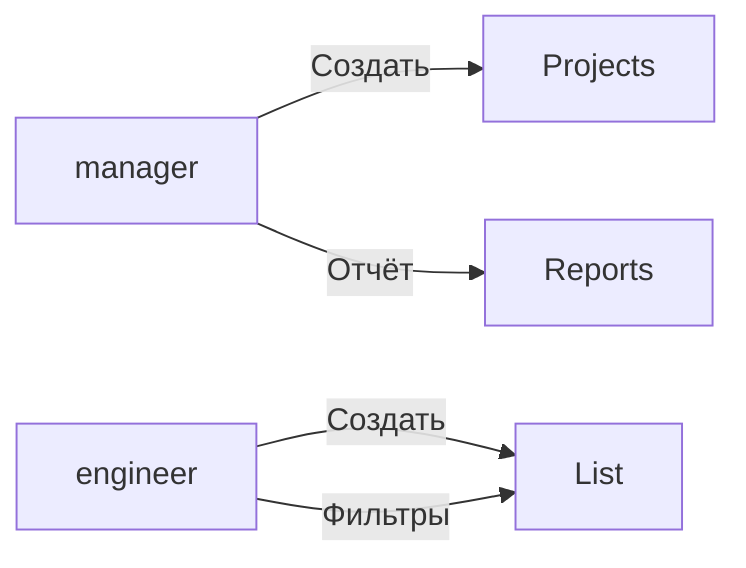

# Use Cases

Акторы: manager, engineer

- UC-1: Вход в систему
- UC-2: Создание проекта (manager)
- UC-3: Создание дефекта с вложением
- UC-4: Фильтрация и просмотр дефектов
- UC-5: Получение сводного отчёта

