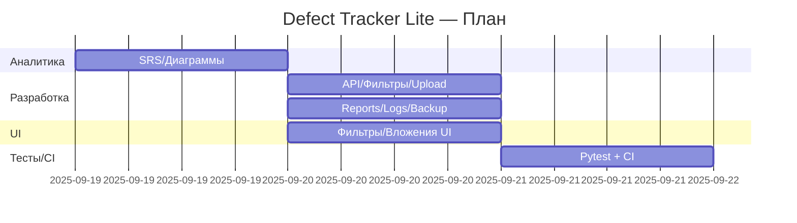

# WBS & Gantt

- Аналитика: SRS, UseCases, ERD, риски
- Бэк: JWT, фильтры, upload, отчёты, логи, backup
- Фронт: загрузка файла, фильтры, карточки
- Тесты/CI: pytest + GitHub Actions
- Эксплуатация: README

